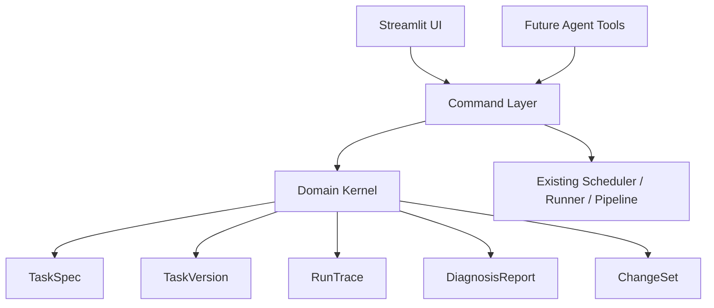

# Domain Kernel Plan

InsightBot 的下一阶段目标不是把 Streamlit 控制台做得更复杂，而是把核心任务对象、操作命令和运行证据抽成一层稳定的 Domain Kernel。Human UI 和未来 Agent Tools 都应该通过同一套内核读取任务、执行 Dry Run、生成诊断、提出配置变更。

## Goal

第一阶段目标：

- 将现有 `tasks.json` 任务规范化为机器可读的 `TaskSpec`。
- 为任务配置生成稳定的 `TaskVersion` 指纹，便于 Dry Run、正式运行、诊断和回滚引用。
- 把关键操作包装成 command，而不是散落在 UI 按钮逻辑里。
- 将运行结果转换为结构化 `RunTrace`。
- 将常见异常转换为结构化 `DiagnosisReport`。

第一阶段不做：

- 不重写现有 pipeline。
- 不迁移 `tasks.json` 存储格式。
- 不实现完整 MCP server。
- 不做多 Agent 编排。
- 不做 SaaS 用户/权限系统。

## Architecture

## Core Objects

### TaskSpec

Canonical, read-friendly task definition derived from existing task config.

Required fields:

- `task_id`
- `name`
- `enabled`
- `pipeline`
- `sections`
- `sources`
- `channels`
- `schedule`
- `quality_policy`

### TaskVersion

Stable fingerprint for a normalized `TaskSpec`.

Required fields:

- `task_id`
- `version_id`
- `fingerprint`
- `created_at`
- `spec`

The first implementation can compute versions in memory from the normalized spec. Persistent version snapshots can be added after the command boundary is stable.

### RunTrace

Structured evidence for one Dry Run or real run.

Required fields:

- `run_id`
- `task_id`
- `task_version_id`
- `trigger_type`
- `ok`
- `pipeline`
- `stages`
- `channel_results`
- `errors`
- `warnings`

RunTrace should be persisted inside existing `data/task_runs.jsonl` records so the UI, Scheduler, and future Agent tools can inspect the same run evidence. The legacy summary fields remain for compatibility, while the domain fields provide structured evidence:

- `run_id`
- `task_version_id`
- `run_trace`
- `diagnosis`

### DiagnosisReport

Structured findings derived from a `TaskSpec` and/or `RunTrace`.

Initial finding types:

- `missing_sections`
- `missing_sources`
- `missing_channels`
- `empty_candidates`
- `empty_screening`
- `unassigned_candidates`
- `empty_final_output`
- `channel_failure`

### ChangeSet

Planned but not yet applied configuration change.

First phase only defines the object shape. Applying changes can remain explicit and manual until versioned task storage is added.

## Command Layer

First phase commands:

- `get_task_spec(task_id)`
- `get_task_version(task_id)`
- `validate_task(task_id)`
- `dry_run_task(task_id)`
- `run_task(task_id)`
- `diagnose_run(run_trace)`
- `propose_task_changeset(task_id, target_task_definition, intent, rationale)`
- `apply_changeset(changeset)`
- `create_task(task_id, task_definition, intent, rationale)`
- `delete_task(task_id, intent, rationale)`

## Tool Manifest

The first Agent-facing layer is a machine-readable manifest, not a full MCP server.

`get_tool_manifest()` describes:

- available Domain Kernel commands;
- input and output schema shape;
- command category;
- risk level;
- whether human approval is required.

Default approval policy:

- Read and diagnosis commands do not require approval.
- `dry_run_task` does not require approval because it does not send messages.
- `run_task` requires approval because it can send channel messages.
- `apply_changeset`, `create_task`, and `delete_task` require approval because they mutate task storage.

The Scheduler exposes this through `get_tool_manifest_command()` and adds runtime task ids. This keeps future MCP or Agent Tool API adapters thin: they should call Domain Commands rather than inspect Streamlit UI state or patch `tasks.json` directly.

The executable internal boundary is `Scheduler.execute_tool_call(tool_name, arguments, approved=False)`.

It provides the first Tool API adapter:

- `list_tasks`, `get_task_spec`, `get_task_version`, `validate_task`, and `dry_run_task` can run without approval.
- `run_task`, `apply_changeset`, `create_task`, and `delete_task` require `approved=True`.
- All routes reuse the same Scheduler and Domain Command methods that the UI uses.
- This is not a public network API or MCP server yet. A future MCP adapter should wrap this method rather than reimplement command routing.

Future commands:

- `rollback_task_version(task_id, version_id)`
- `send_run_output(run_id)`

## Implementation Plan

1. Add `insightbot/domain/` with dataclass models and JSON-safe serialization.
2. Add adapter functions that convert current task dictionaries into `TaskSpec`.
3. Add deterministic fingerprinting for `TaskVersion`.
4. Add `RunTrace.from_task_result()` for existing runner output.
5. Add rule-based diagnosis for task config and run results.
6. Add tests for object conversion, version stability, trace extraction, and diagnosis findings.
7. Keep Streamlit changes minimal: current UI can start reading these objects later, after the kernel is covered by tests.
8. Wrap task config mutations in `ChangeSet` before applying them to storage.
9. Expose a machine-readable Tool Manifest for current commands.
10. Persist `RunTrace` and `DiagnosisReport` into the existing run history records.
11. Add an internal executable Tool API boundary that routes through Domain Commands.

## Acceptance Criteria

The first Domain Kernel slice is complete when code can answer:

- What is the canonical `TaskSpec` for a task?
- Did two semantically identical task configs produce the same version fingerprint?
- Which pipeline stages produced candidates, selected items, unassigned items, and final output?
- Why is a task obviously invalid before running?
- Why did a run produce no output or fail to send?
- What would change before a task configuration update is applied?
- Where is the structured evidence for the latest run?
